# Coffee Bean Supply Chain DApp

1. [Introduction](#introduction)
2. [Rinkeby test network](#rinkeby-test-network)
3. [Project structure](#project-structure)
4. [Supply Chain](#supply-chain)
5. [Quickstart](#quickstart)
6. [Preparation](#preparation)
7. [Workflow](#workflow)
8. [Check authenticity of an item](#check-authenticity-of-an-item)
9. [Running tests](#running-tests)

## Introduction
This project implements a DApp for tracking coffe beans through a supply chain from the farm that harvests the beans to the end consumer that purchases them.
This is an implementation for 3. project required by the Udacity "Blockchain Developer" Nanodegree program. It was built upon the provided skelleton contracts from the Udacity project.

## Rinkeby test network
The smart contract implemented in this project is also available on the Rinkeby test network. The contract address is

```
0xCFd171E87aE481859c84F6c6e44B46F865d3242B
```

and the transaction hash is

```
0x714190843fcfa0bcc8f8b1dae37c4cd72354620800e2928620f82fde8f707610
```

On etherscan, you can find the transaction details for the contract under 
https://rinkeby.etherscan.io/tx/0x714190843fcfa0bcc8f8b1dae37c4cd72354620800e2928620f82fde8f707610

## Project structure
The project consists of 2 main directories:

1. `app` - This directory contains the frontend code which was build using `vue` and `vuetify`
2. `eth` - Here you will find the contracts as well as the `truffle` configurations needed to build and deploy the contracts to a ethereum network

## Supply Chain
### Process description
The coffe beans (items) will go through a total of 8 stages (`Harvested`, `Processed`, `Packed`, `ForSale`, `Sold`, `Shipped`, `Received`, `Purchased`) described by the state diagram below.

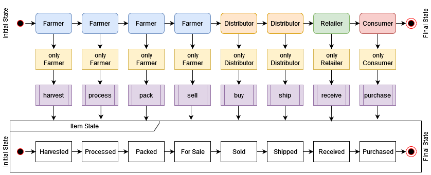

There are a total of 4 roles involved (`Farmer`, `Distributor`, `Retailer`, `Consumer`). As you can see in the state diagram as well as in the activity diagram below, actions cannot be executed by all roles. It always depends on the current state of the item in the supply chain who can execute the next action.

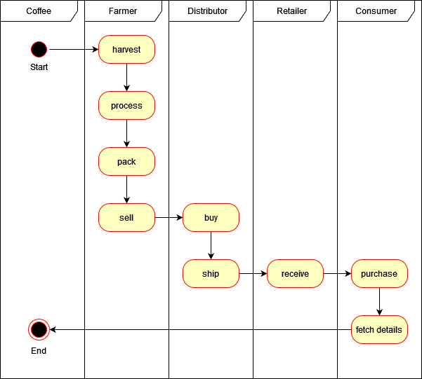

Another way to visualize the order of the action calls can be seen by the following sequence diagram.

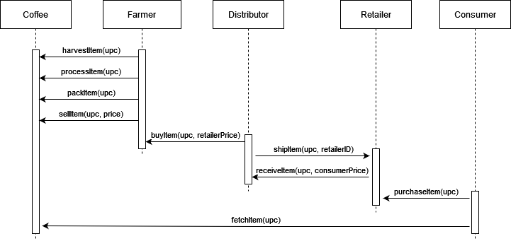

Basically, a `Farmer` `harvests` the beans, `processes` them, `packs` them and then put them on `sale` for `Distributors`. A `Distributor` can `buy` the beans and `ship` them the a `Retailer` which in turn `receives` the package. The final action is done by a `Consumer` who `purchases` the final product.

> NOTE: There are 5 occasions where additional input besides the UPC is needed to pass an item to the next stage in the supply chain:
>
> 1. When the item is harvested, the farmer can add product and farm details such as product notes and the name of the origin farm
> 2. When the item is sold by the farmer, a price can be set
> 3. When the item is bought by a distributor, a new price for retailers can be set
> 4. When the item is shipped by a distributor, the retailers address must be specified
> 5. When the retailer receives the item, a new price for the end consumers can be set

Finally, at all times everyone is able to check the current state of the product as well as the origin and authenticity by fetching the item information from the smart contract (`fetchItem`).

### Implementation details
The following class diagram shows how the main contract interacts with other contracts and libraries.

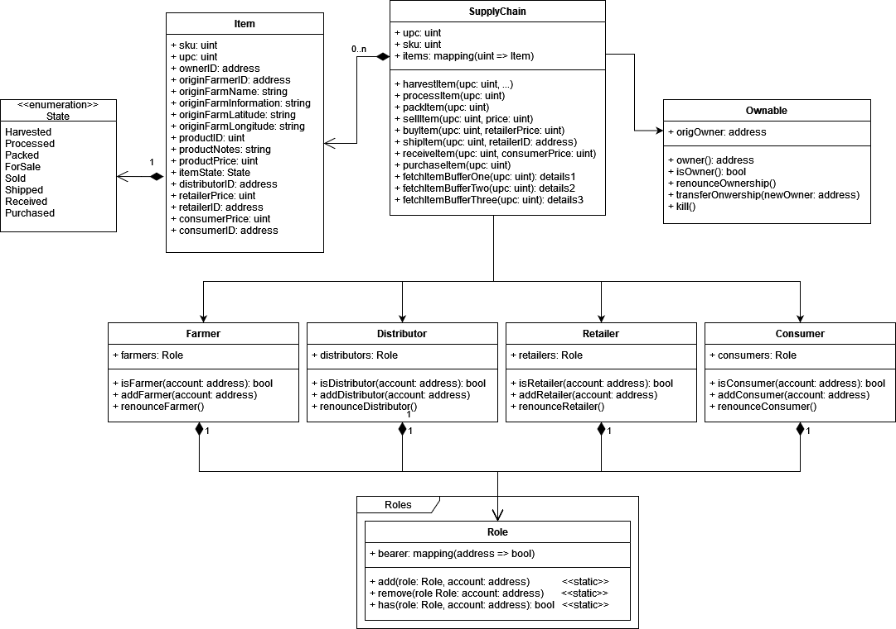

The `SupplyChain` contract is the main contract which inherits from the `Ownable` as well as from the `Farmer`, `Distributor`, `Retailer` and `Consumer` contracts. The `Ownable` contract provides transfer of ownership capabilities and lets the owner kill the contract. The other 4 contracts provide role management and allow to add new addresses/accounts to the corresponding roles. 

The main `SupplyChain` contract contains all functions for sending an item through the supply chain.

## Quickstart
### Prerequesites
1. Node.js 13.12.0 with npm 6.14.4 or higher: https://nodejs.org/en/download/
2. Truffle v5.4.22 or higher: `npm install -g truffle`
3. Solidity compiler (solc) `0.8.10` or higher (should automatically be picked up and installed when compiling the contracts with truffle as it is configured in the `truffle-config.js` file)
4. Ganache CLI v6.12.2 (ganache-core: 2.13.2) or higher `npm install -g ganache-cli`
5. Browser with installed MetaMask Plugin: https://metamask.io

### Run local development environment
1. Run `ganache-cli` with the provided mnemonic:  
```bash
ganache-cli -m "spirit supply whale amount human item harsh scare congress discover talent hamster"
```
2. Open a new terminal and install dependencies needed by the truffle project
```bash
cd eth
npm install
```
3. Migrate and deploy the contracts and deploy them on the local network:
```bash
truffle migrate --reset
```
> NOTE: Solidity compiler `0.8.10` or above should be used to compile the contracts. Truffle should automatically pick up this version and install the required compiler as it is configured in the `truffle-config.js` file
3. Install all necesarry dependencies for the frontend project
> NOTE: If you do not want to build the frontend by yourself, you can also use the prepackaged dist directory. In this case you can skip the next step, but you will have to install a http server that can serve the directory (e.g. with `npm install -g http-server` and then `http-server app/dist` to serve the frontend at `http://localhost:8080`)
```bash
cd ../app
npm install
```
4. Run the frontend
```
npm run serve
```
5. Open a webbrowser on http://localhost:8080 and follow the steps described there

## Preparation
### 1. Connect MetaMask
Upon opening the frontend, you will be presented with a loading screen. Additionally a MetaMask popup should open that asks you to connect to the website. Follow the instructions and the loading screen should disappear.
> NOTE: Make sure to connect metamask to the ganache backend. You might need to add a new network in MetaMask. As an address (RPC-URL) you should use `http://localhost:8045` and for the Chain ID `1337`

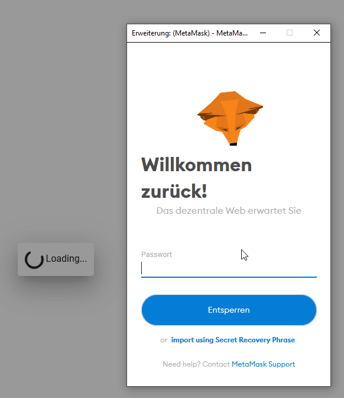
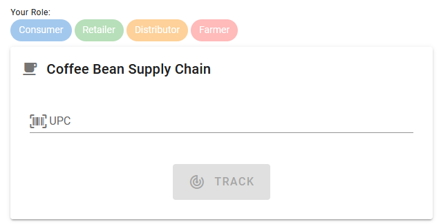


### 2. Import the contract owner to MetaMask
In order to interact with the contract, accounts with specific roles must be added. At the beginning only the owner is allowed to interact with the contract. The owner will automatically have all roles assigned. Impor the contract owner into MetaMask by using the private key:
```
0x9137dc4de37d28802ff9e5ee3fe982f1ca2e5faa52f54a00a6023f546b23e779
```
> NOTE: this will only work, if you started ganache-cli with the provided mnemonic from above)

Switch the MetaMask account to the newly imported account. The frontend should automatically detect the change and the roles assigned to the account should light up:

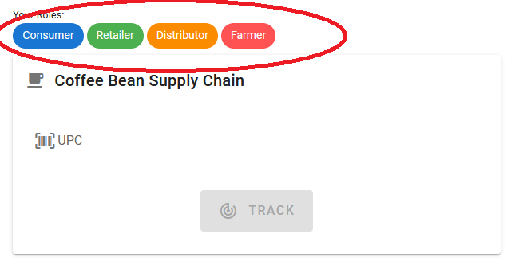

### 3. [Optional] Add more accounts and assign roles
With the owner, all roles should light up on the frontend, meaning, that we can access all contract functions. If you would like, you can import more accounts into MetaMask and assign different roles to them using the appropiate contract functions:

```
addConsumer(address account)
addRetailer(address account)
addDistributor(address account)
addFarmer(address account)
```

These functions can be called by the owner of the contract.
The following accounts with private keys should be available and can be imported into MetaMask:
> NOTE: The account **0** is the owner account which you should have imported, already

```
Available Accounts
==================
(0) 0x27D8D15CbC94527cAdf5eC14B69519aE23288B95 (100 ETH)
(1) 0x018C2daBef4904ECbd7118350A0c54DbeaE3549A (100 ETH)
(2) 0xCe5144391B4aB80668965F2Cc4f2CC102380Ef0A (100 ETH)
(3) 0x460c31107DD048e34971E57DA2F99f659Add4f02 (100 ETH)
(4) 0xD37b7B8C62BE2fdDe8dAa9816483AeBDBd356088 (100 ETH)
(5) 0x27f184bdc0E7A931b507ddD689D76Dba10514BCb (100 ETH)
(6) 0xFe0df793060c49Edca5AC9C104dD8e3375349978 (100 ETH)
(7) 0xBd58a85C96cc6727859d853086fE8560BC137632 (100 ETH)
(8) 0xe07b5Ee5f738B2F87f88B99Aac9c64ff1e0c7917 (100 ETH)
(9) 0xBd3Ff2E3adEd055244d66544c9c059Fa0851Da44 (100 ETH)

Private Keys
==================
(0) 0x9137dc4de37d28802ff9e5ee3fe982f1ca2e5faa52f54a00a6023f546b23e779
(1) 0x18911376efeff48444d1323178bc9f5319686b754845e53eb1b777e08949ee9b
(2) 0xf948c5bb8b54d25b2060b5b19967f50f07dc388d6a5dada56e5904561e19f08b
(3) 0xfad19151620a352ab90e5f9c9f4282e89e1fe32e070f2c618e7bc9f6d0d236fb
(4) 0x19d1242b0a3f09e1787d7868a4ec7613ac4e85746e95e447797ce36962c7f68b
(5) 0x3bb675f8c07099816e23a3e283090cfb0f793ab625b73ca51a2d027a3c1f2d0e
(6) 0x0faf45306c7daf14d86c266690ce54490e8c0104154cafa87d9e93724efc239d
(7) 0xf2a921dee0ebd7bfaba1a271bcd48c99baa6341a1cdf84ba843521a5555e0273
(8) 0x62734594840dade92a24448c8f676cc3c59fd68909837303417295f2c0f27963
(9) 0xc29afb730456eb83415046550faf8065c8531765396156db8d97fd1fd64c6a6e
```

## Workflow
### 1. Harvest an item
Harvest your first item by choosing an account that has the `Farmer` role assigned to it and by entering a non existing UPC (e.g. 0) into the designated text field and pressing the "TRACK" button.

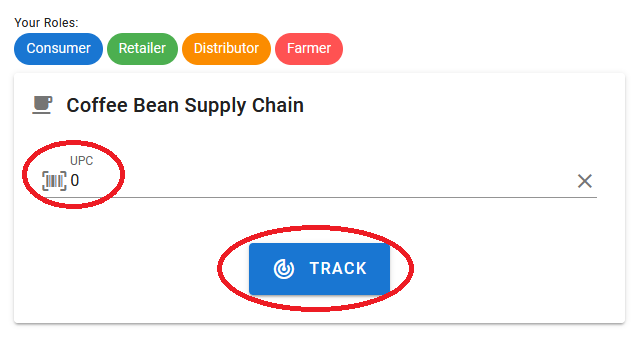

If the item does not exist and you have the necessary `Farmer` role, you should see a "HARVEST ITEM" button. Press it.

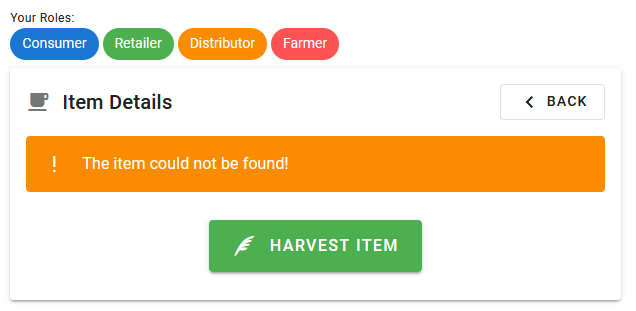

On the next page, enter all details for the new item and once again press `HARVEST ITEM`.

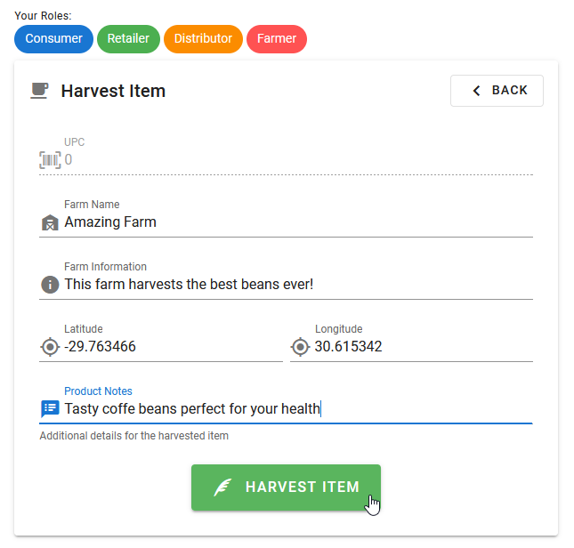

Accept the transaction that should appear in the MetaMask popup. You should now automatically be redirected to the item details page, where you can further interact with the item and where you can verify the authenticity.

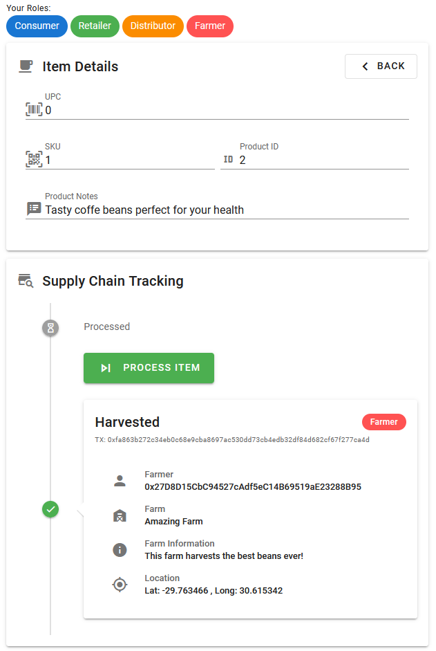

You will find the following information:
* General item information (UPC, SKU, ProductID, Product Notes)
* Supply Chain Tracking Details
  * Current and past states
  * Transaction hashes
  * Details for each of the states
  * The next state in the supply chain
  * An action button for advancing the supply chain (only available if the currently connected account has the correct role assigned)

### 2. Process & Pack item
Use a `Farmer` account and open the items details page. An action button "PROCESS ITEM" should be available. Click it.

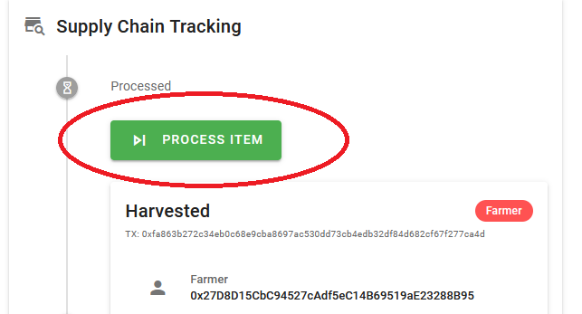

Accept the transaction in the MetaMask popup and the item should now be marked as processed.

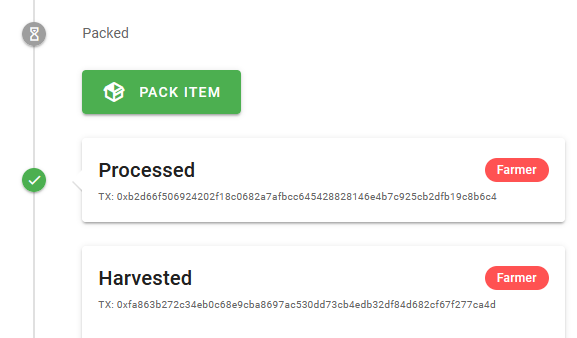

Do the same for the "PACK ITEM" action button and the new state of the item should show up as "Packed"

### 3. Sell item
Now the farmer account can be used to sell the item to a distributor. Click the "SELL ITEM" action button.

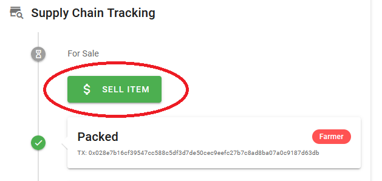

On the next page enter a price in ETH for which the item should be sold to distributors. Once a price has been entered, you can click on "SELL ITEM".

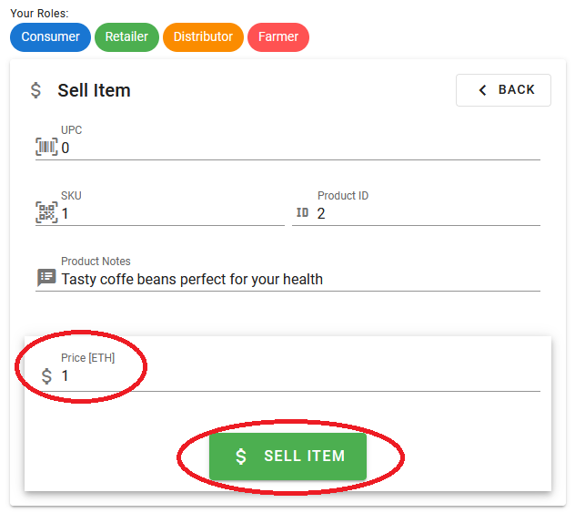

Accept the transaction in the MetaMask popup and the item should not be available to be bought by distributors

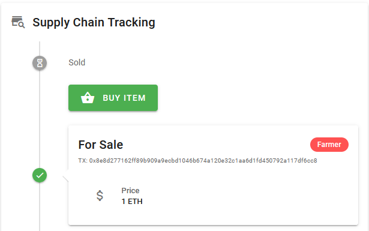

### 4. Buy item
> NOTE: You might have to switch the account to a distributor in order to continue with this step. Otherwise the appropiate action button might not be available to you.

Click on "BUY ITEM", a new page should open where you can check the price of the item once again and also enter a new price for the item that retailers will have to pay in the next step. Once you have entered a new price for retailers, click on "BUY ITEM".

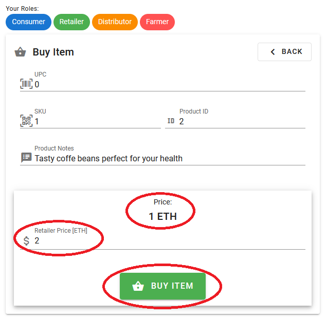

Again, approve the transaction in the MetaMask popup. The item should now be available to be shipped to a retailer.

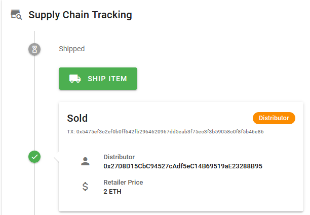

### 5. Ship item
As a distributor, click on "SHIP ITEM". On the next page you will have to enter the address of the retailer to which the item will be sold. This must be done in order to prevent other retailers from receiving the item. You can choose any valid address of a known retailer. In this example the contract owner address (which has all roles assigned to it) was used.

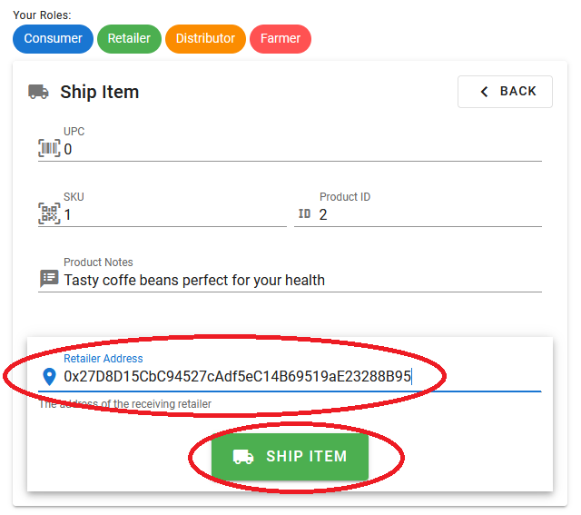

Hit "SHIP ITEM" and accept the transaction in the MetaMask popup once again. The item should now be marked as shipped.

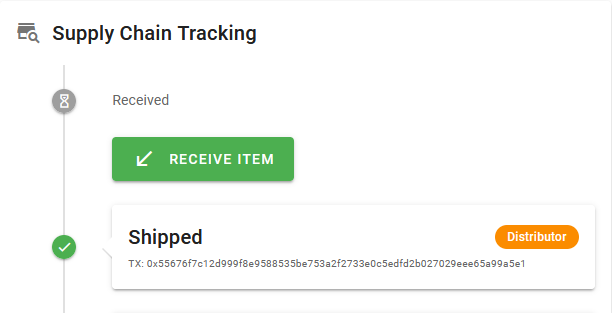

### 6. Receive item
> NOTE: You might have to switch the account to a retailer in order to continue with this step. Otherwise the appropiate action button might not be available to you.

The next action must be executed with the retailer that was specified in the step before, otherwise the item cannot be received. Click on "RECEIVE ITEM". A new page will open where you can check the price that you will have to pay as a retailer as well as a text field where you can enter a new price for the end consumers.

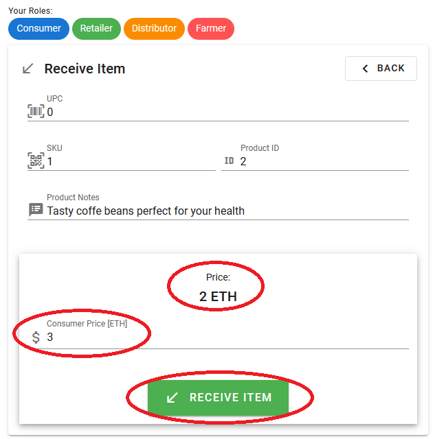

Hit "RECEIVE ITEM" and once again approve the transaction in the popup. The item should not be available to be purchased by consumers.

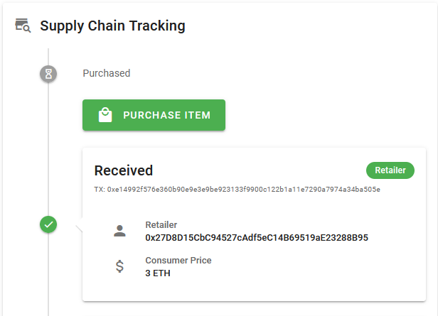

### 7. Purchase item
> NOTE: You might have to switch the account to a consumer in order to continue with this step. Otherwise the appropiate action button might not be available to you.

The final step is for a consumer to purchase the item. Change the account to a consumer and click on "PURCHASE ITEM". A confirmation page will appear, where you can check the price one last time.

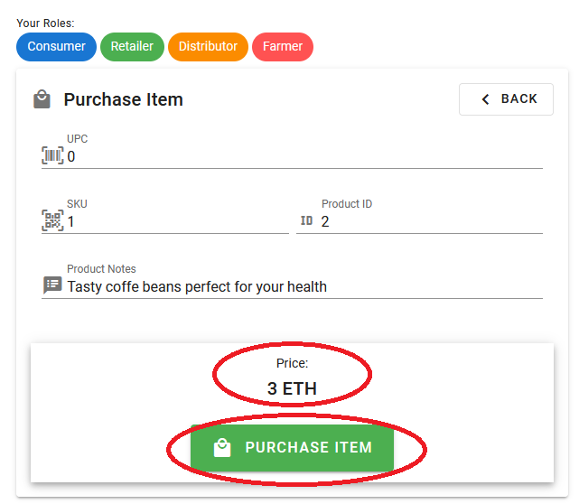

Upon clicking "PURCHASE ITEM", confirm the transaction one last time and the workflow is complete. You should now see a complete supply chain with all the information for the item including transaction hashes.

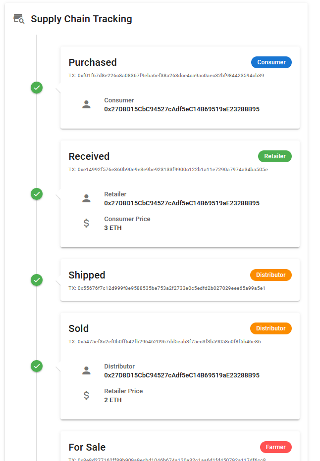

## Check authenticity of an item

To check the authenticity as well as the current state of an item in the supply chain, open the main page of the frontend. Simply enter the UPC of the item that you would like to track and click "TRACK".


If the item could be found, you will find all information on the page that appears afterwards.

## Running tests
There are tests present within the `eth/test` directory. Tests can be run with the following command:

```bash
cd eth
truffle test
```

If the tests succeed, the output should look similar to this:

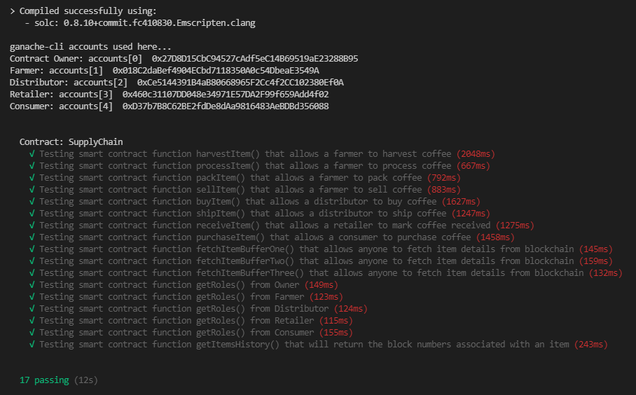